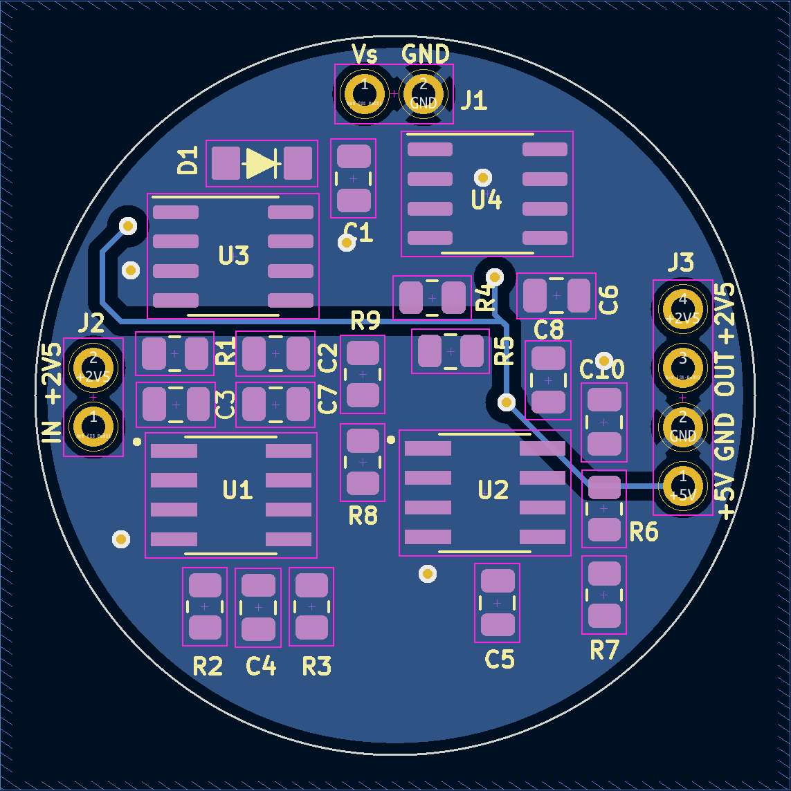
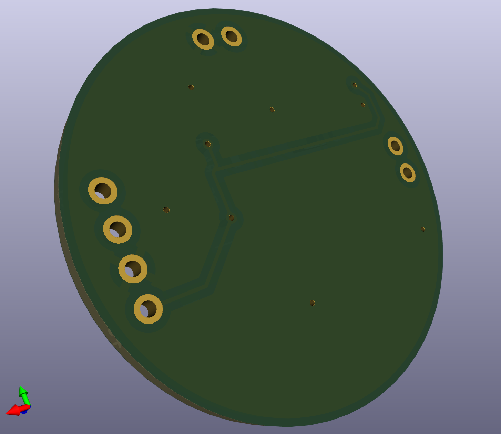

# RM Sensor
31mm Diameter board using SMD 0805_2012 footprints for resistors and capacitors  
## Schematic

## PCB with no fill

## PCB with fill

## PCB with front fill

## PCB with back fill

## 3D View of the front of the PCB

## 3D View of the back of the PCB

